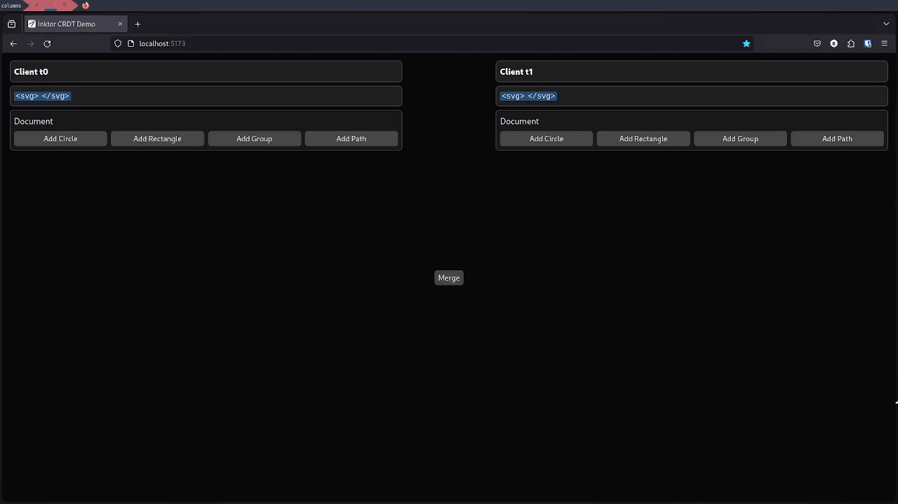
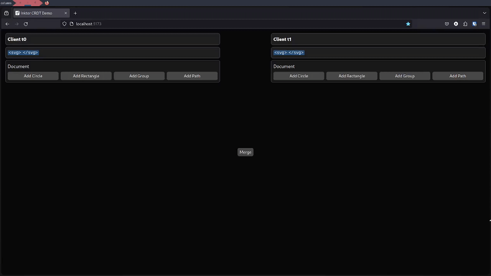
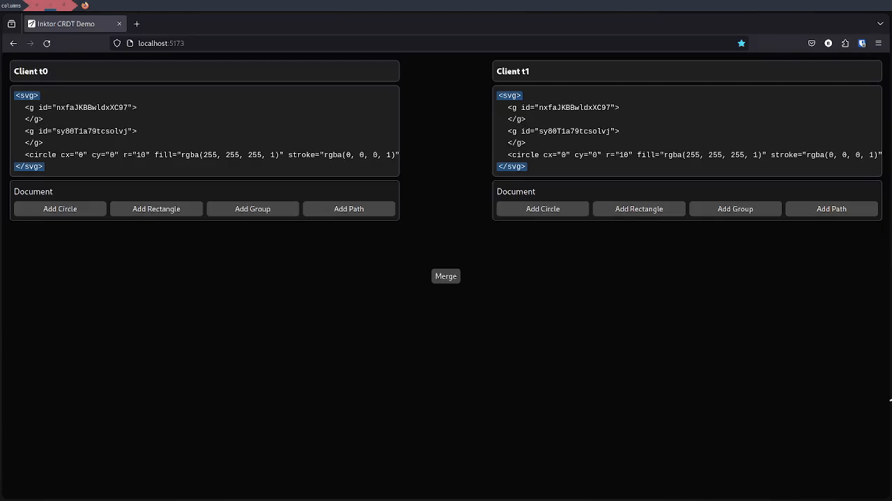

# Inktor CRDT Demo Application.

This is the demo application for Inktor CRDT, it is designed to demonstrate the basic functionalities
of a collaborative vector graphics editing CRDT.

## Usage
You need to build the library first by following the instructions in the root readme page of this project.
Once you have built the WASM and JS versions of the library. You can run the following commands to start
the development server.
```sh
$ npm i
$ npm run dev
```
## Case
In my thesis I talk about some CRDT cases, that the algorithm we propose aims to fulfill. Below are gifs of cases I talk about in my thesis, by using this
demo application.

### Case 1: Concurrent changing different attributes of the same element


### Case 2: Concurrently moving an element and deleting an element


### Case 3: Concurrently moving an element to different groups

