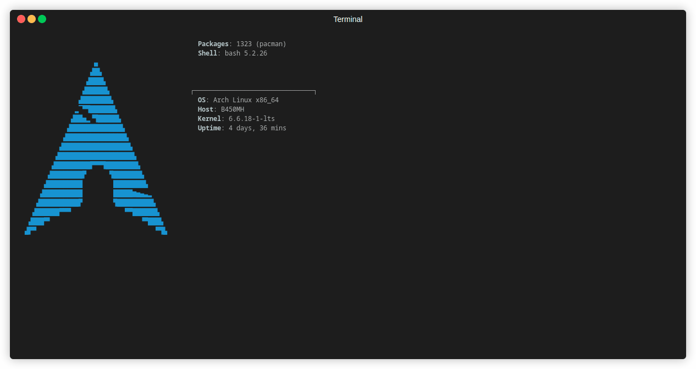

# Inktor CRDT

This is a CRDT library for collaborative vector graphics editing.

## Dependencies
* `rust >= 1.74.1`
* `binaryen >= 116` (for compilation to JavaScript.)
    
    `binaryen` is packaged in ArchLinux, Ubuntu and Homebrew for MacOS.
    The `binaryen` package will give you `wasm2js` which is used to convert WASM into JavaScript. This can be helpful for browsers that do not support WASM.
* `wasm-pack >= 0.12.1`

    Which can be installed through the following commands:
    ```
    cargo install wasm-pack
    ```

## How to build the library.



You can build the WASM version of the library by running:

```
$ source alias.sh
$ wasm-build
```
Once you have build the library you can copy the contents of the `pkg` file. If you are on a project with NodeJS, you can add it to the `package.json` file as a dependency with `@brynghiffar/inktor-crdt: "file:./pkg"`. See demo example for details.

You can build the JS version of the library by running:
```
$ source alias.sh
$ wasm-buildjs
```

## Running tests


You can run the tests with `cargo test`. The cases discussed in my thesis paper are at the bottom of the file `src/crdt/core2.rs`.

## Running the demo application.

To run the demo application you need to build both the WASM version and the JS version. Once built you can run `npm i` and then `npm run dev` to run the development server.